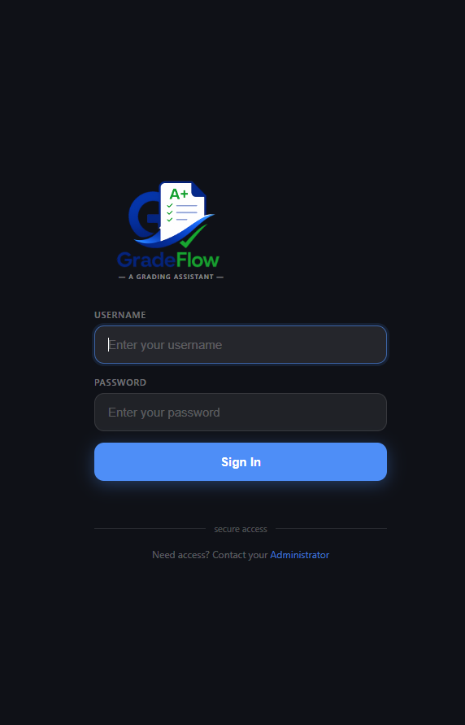
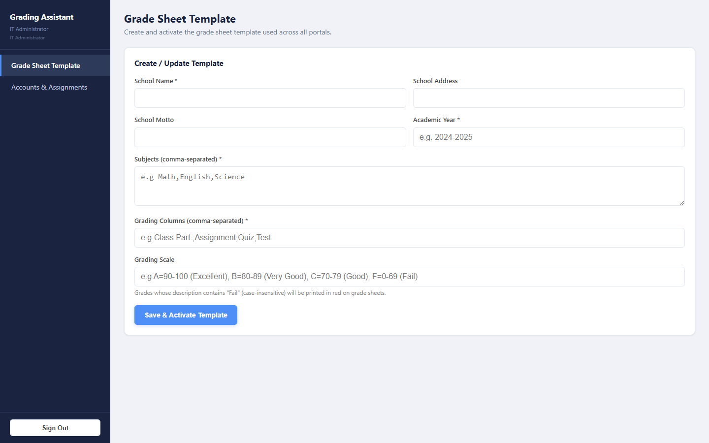
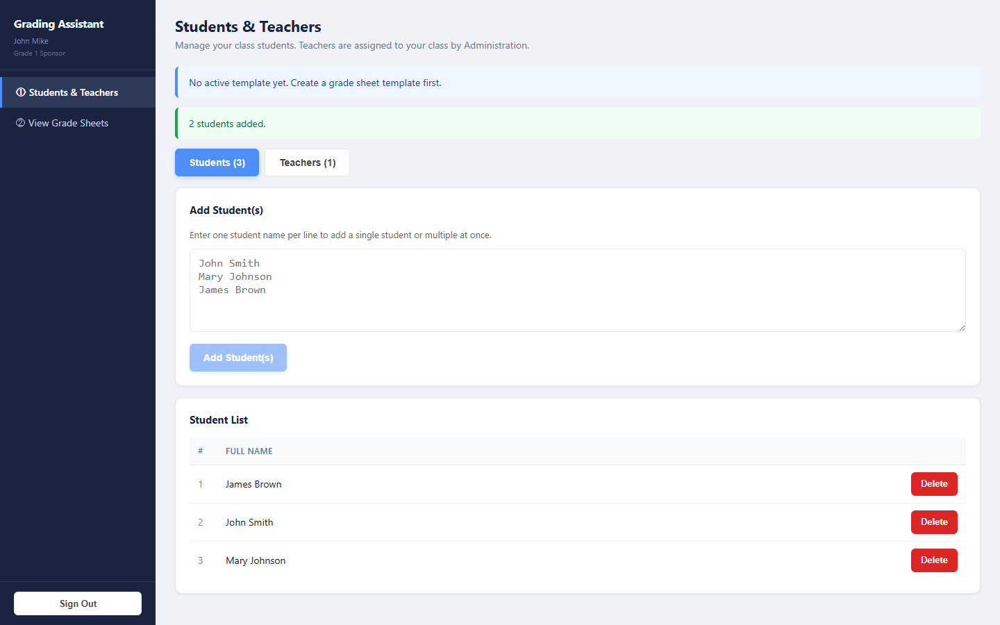
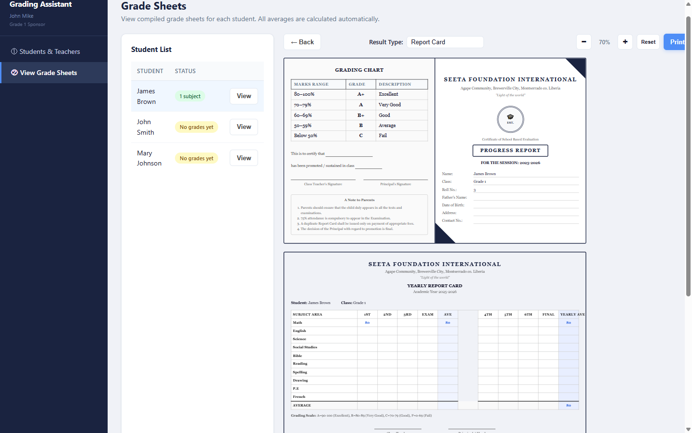
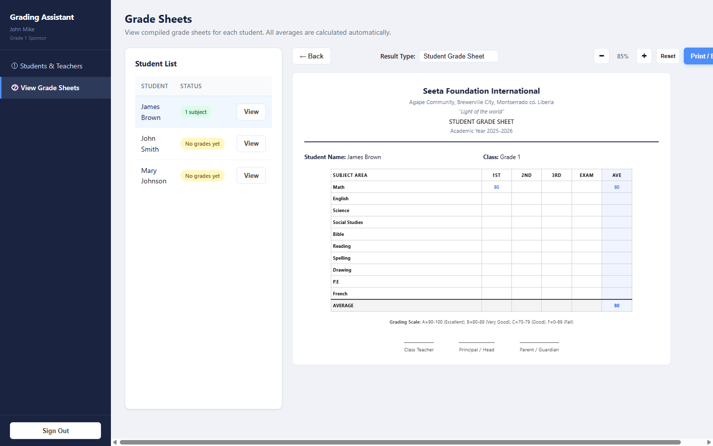
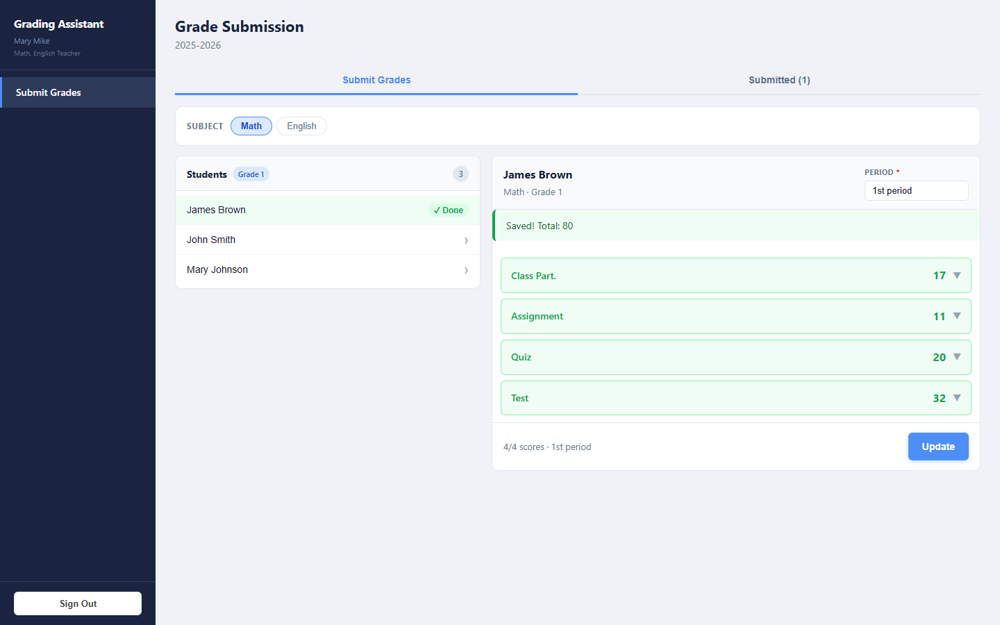

# GradeFlow REST API

## A high school grading assistant designed to help schools process students reports faster and more accurately.

Most high schools still manually process students report cards. From gathering students grades across multiple subjects, to calculating averages, before inserting final grades on report cards.
This takes hours of work, which results in delays in delivery of students reports after a period or academic year. And these report cards sometimes contain mistakes resulting from the heavy manual workload placed on sponsors or administrators. This project is an attempt to fix that. It contains the following:


####

* IT/School Admin portal - which sets the whole thing up: creates sponsor and teacher accounts, assigns teachers to sponsors/classes, and configures the grading template (school name, school address, subjects, grading columns, grading scale, etc.) used across the application.

* Sponsors portal(one per class) - manage their student list, see which teachers/subjects have submitted grades, and view or print students compiled grade sheets, which has all students grades gathered across multiple subjects with calculated averages automatically — broken down by period or as a full yearly report card.

* Teachers log in, select a student, subject, grade/class, period, enter scores across the dynamic grading columns the IT/School admin configured, and submit grades. They can update a submission if they made a mistake.

## 📸 Snapshots

### Login



### IT Admin Dashboard



### Sponsor Dashboard





### Teacher Grade Entry



---
## Companion Repository

This project contains the Spring Boot REST API for GradeFlow.

Frontend (React):
https://github.com/dennis-nyemah/gradeflow-frontend
---
## Running locally

**Backend**
```bash
./mvnw spring-boot:run
```

**Frontend**
```bash
npm install
npm run dev
``

**Environment variables (backend)**
```env
PORT=
SPRING_DATASOURCE_URL=
SPRING_DATASOURCE_USERNAME=
SPRING_DATASOURCE_PASSWORD=

GRADEFLOW_JWT_SECRET=
GRADEFLOW_JWT_EXPIRATION_MS=

ADMIN_USERNAME=
ADMIN_PASSWORD=
```

## Author

Dennis P. Nyemah

Backend Developer | Java • Spring Boot • PostgreSQL

Passionate about building software that solves real-world problems and exploring AI-powered systems.
